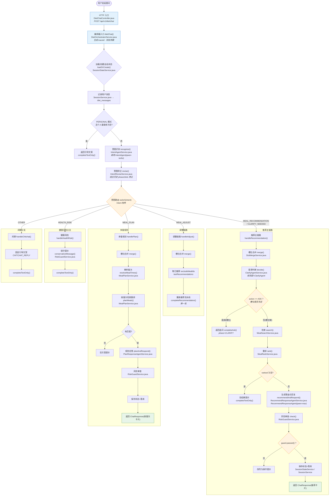

# Diet Agent 用户提问处理流程图

> 一张图看懂：用户提问后系统如何判断意图、进入哪条流程，以及每一步对应的代码文件。
> 入口：`POST /api/v1/diet/chat` → `DietChatController.dietChat` → `DietOrchestratorService.dietChat`

## 各流程对应文件速查

| 流程/步骤 | 文件 |
|-----------|------|
| HTTP 入口 | `controller/chat/DietChatController.java` |
| 编排器（状态机总调度） | `service/orchestrator/DietOrchestratorService.java` |
| 会话状态加载/保存 | `service/session/SessionStateService.java` |
| 消息落库 | `service/session/SessionService.java` |
| 意图识别 | `service/intent/IntentAgentService.java` |
| 意图矫正 | `service/intent/IntentReviseService.java` |
| 槽位合并 | `service/slot/SlotMergeService.java` |
| 澄清追问 | `service/clarify/ClarifyAgentService.java` |
| 餐食检索 | `service/meal/MealSearchService.java` |
| 餐食重排 | `service/meal/MealRankService.java` |
| 推荐应答（理由+口语） | `service/recommend/RecommendResponseAgentService.java` |
| 多餐规划 | `service/plan/MealPlanService.java` |
| 规划应答 | `service/plan/PlanResponseAgentService.java` |
| 健康风险守卫 | `service/risk/RiskGuardService.java` |
| 链路追踪 | `service/trace/AgentTraceService.java` |
| Agent 构建器 | `agent/builder/*AgentBuilder.java` |
| 意图枚举 | `enums/Intent.java` |

## 六种意图路由（`enums/Intent.java`）

| 意图 | 含义 | 处理分支 |
|------|------|----------|
| `MEAL_RECOMMENDATION` | 餐食推荐 | 推荐主链路 |
| `CLARIFY_NEEDED` | 需要澄清 | 推荐主链路（内部走澄清） |
| `MEAL_ADJUST` | 换一批/调整 | 调整链路 |
| `MEAL_PLAN` | 多餐规划 | 规划链路 |
| `HEALTH_RISK` | 健康风险咨询 | 保守提示 |
| `OTHER` | 闲聊/无关 | 固定引导 |
